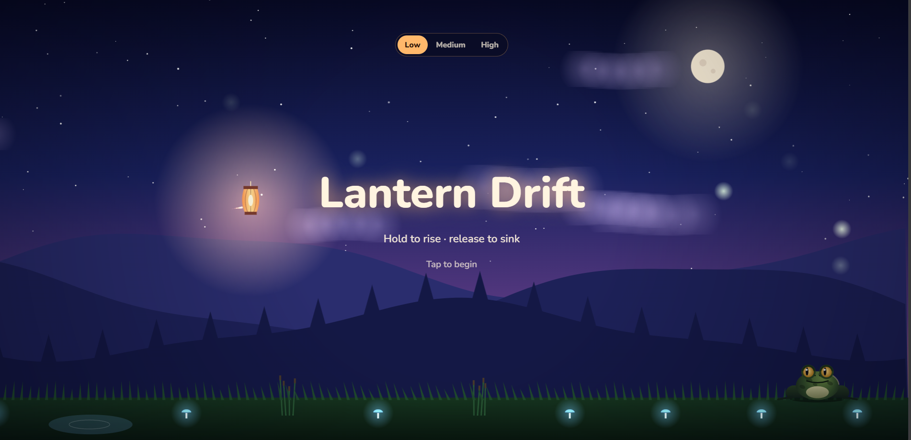

# Lantern Drift

A calm, glowing night-sky game. Float a paper lantern through the dark, gather fireflies to grow your light, and stay out of reach of the frogs below.

Built with plain HTML, CSS and JavaScript on a single canvas. No libraries, no build step.

[▶ PLAY](https://abhi-y-diord.github.io/Lantern-Drift/)



## How to play

Hold to rise, release to sink. Collect fireflies to make your glow bigger and your score higher. The run ends if you touch the ground, get caught by a frog's tongue, or get hit by the bird.

**Controls**

| Device | Action |
| --- | --- |
| Touch screen | Press and hold to rise |
| Mouse | Click and hold to rise |
| Keyboard | Hold Space to rise |

## What's in the world

**Frogs** wait on the ground and scroll past as you fly. Each one shows a warning before it strikes: red rings tighten on the ground and its eyes flare.

| Frog | Behavior | Dodge bonus |
| --- | --- | --- |
| Green | Grabs with its tongue | none |
| Yellow | Leaps into the air and strikes from above | +50 |
| Red | Hurls a ball of mud in an arc | +80 |

A mud hit does not end the run. It covers your lantern for a few seconds, dimming the glow and making you sink faster. Frogs also eat fireflies that drift low.

**The bird** appears now and then once a run is underway. A red "!" and a dotted line mark its height, then it dashes across the sky.

## Difficulty and scoring

Choose Low, Medium or High before a run, or after a run ends. Higher levels give less warning and shorter breaks between frogs.

Score = (fireflies x 10 + distance + dodge bonuses) x level multiplier

| Level | Multiplier |
| --- | --- |
| Low | x1 |
| Medium | x1.5 |
| High | x2 |

Each level keeps its own best score, and your choice of level is remembered. Both are saved in your browser with `localStorage`, so they stay on the device you play on.

## Run locally

Download the project and open `index.html` in any modern browser. An internet connection is only needed for the Nunito web font; the game falls back to a system font without it.

## Project structure

```
index.html   the entire game (markup, styles and code)
README.md    this file
```

## Tech notes

- HTML5 canvas, rendered at up to 2x device pixel ratio
- Layered parallax sky, hills, clouds and a scrolling ground, all drawn in code
- Responsive layout for phones and desktops, with safe-area support
- Respects `prefers-reduced-motion` for the menu fade

